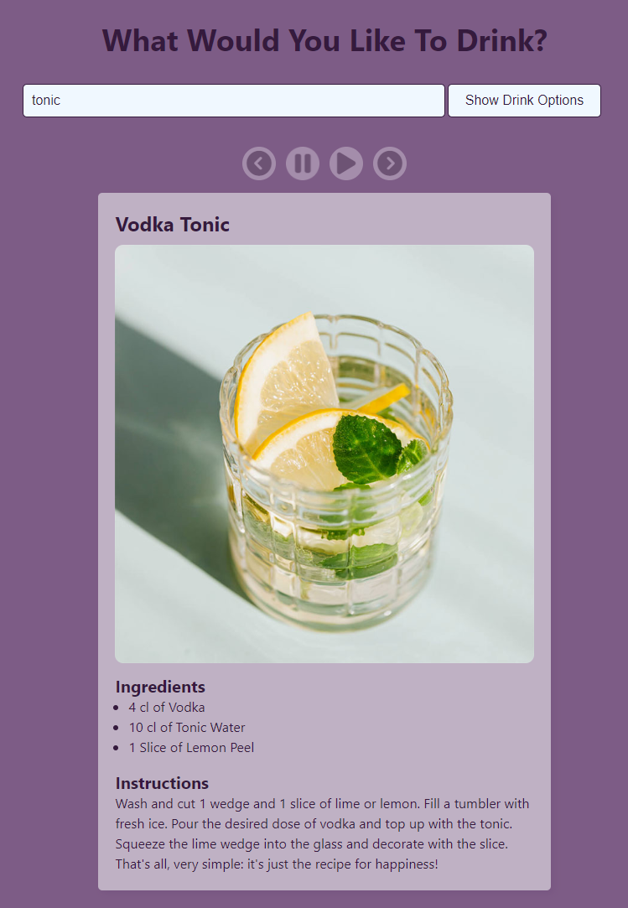

<!-- Improved compatibility of back to top link: See: https://github.com/othneildrew/Best-README-Template/pull/73 -->

<!-- PROJECT LOGO -->
 

  

  <h3 align="center">Drink Deck</h3>

  

    Search for a drink and flip through a carousel of options!
     
    <a href="https://dracula27.github.io/drinkDeck/">View Demo</a>

<!-- TABLE OF CONTENTS -->

  
Table of Contents

  <ol>
    <li>
      <a href="#about-the-project">About The Project</a>
      <ul>
        <li><a href="#built-with">Built With</a></li>
      </ul>
    </li>
    <li><a href="#usage">Usage</a></li>
    <li><a href="#optimizations">Optimizations</a></li>
    <li><a href="#lessons-learned">Lessons Learned</a></li>
    <li><a href="#contact">Contact</a></li>
    <li><a href="#acknowledgments">Acknowledgments</a></li>
  </ol>

<!-- ABOUT THE PROJECT -->

## About The Project

Ever wanted to know that recipe for a certain drink?

With this app, you can search for a drink by name (or partial name) and view all the options via a carousel of options.

(<a href="#readme-top">back to top</a>)

### Built With

- 
- 
- 

(<a href="#readme-top">back to top</a>)

<!-- USAGE -->

## Usage

Type the name, or partial name, of a drink for which you need the recipe and either type the `Enter` key or click the `Show Drink Options` button to display the drink options.
- If only one drink is found, the carousel controls will not display.
- If multiple recipes are found for that drink, the carousel controls will be displayed, and you can pause, restart, or use the arrow keys to skip ahead or go back within the carousel.

(<a href="#readme-top">back to top</a>)

<!-- OPTIMIZATIONS -->

## Optimizations

This project can be improved by:

- [ ] Refactoring the code to account for errors fetching data,
- [ ] Displaying the carousel items that are before and after the current drink to more clearly show the user that multiple drinks were returned,
- [ ] Improving the playing of the carousel to better handle when users search for drinks more than once.

(<a href="#readme-top">back to top</a>)

<!-- LESSONS LEARNED -->

## Lessons Learned

- **API Integration.** When getting the data from TheCocktailDB, I learned how to use `fetch` to get `JSON` data from an external source.
- **Data Manipulation.** Once I had the data from TheCocktailDB's API, I learned how to transform that data into a format I needed for the project.
- **Advanced Interactivity.** Building a carousel was much more intense than I originally thought it would be!

(<a href="#readme-top">back to top</a>)

<!-- CONTACT -->

## Contact

Danielle Andrews - [@DrAcula_codes](https://twitter.com/DrAcula_codes 'Twitter/X') - [daniellerandrews](https://www.linkedin.com/in/daniellerandrews 'LinkedIn') - danielle.andrews.dev@icloud.com

Project Link: [https://github.com/DrAcula27/drinkDeck](https://github.com/DrAcula27/drinkDeck)

(<a href="#readme-top">back to top</a>)

<!-- ACKNOWLEDGMENTS -->

## Acknowledgments

A special thanks to these resources used in the project!

- [TheCocktailDB](https://www.thecocktaildb.com/)
- [GitHub Pages](https://pages.github.com)
- [Font Awesome](https://fontawesome.com)

(<a href="#readme-top">back to top</a>)

